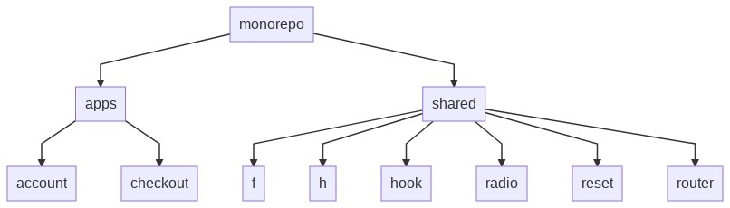

## Simples, pequeno e imperfeito - "Uma visão além da programação"

Ninguém precisa ter muitas habilidades para desenvolver um software que funcione, fazer direito é outra história. Desenvolver um software de maneira correta é um desafio que deixo lançado. Requer maturidade e conhecimentos que a marioria dos programadores ainda não tem.

### Meu objetivo

É minimizar a quantidade de denvolvedores necessários para construir e manter um determinado sistema.

Quando um software é desenvolvido da maneira certa, precisamos de poucos desenvolvedores para construir e manter. As mudanças são cirurgicas (simples e fácil). Deixamos de ser eficiente e nos tornamos eficazes (Faça a coisa certa da forma errada, mas não faça a coisa errada da forma certa). Os esforços são minimizados, as funcionalidades e flexibilidades são maximizadas.

### Embora muitos tentem ser

Não sou um Framework, muito menos uma Library, diferentes deles sou uma Arquitetura inspiracional. Autores de Frameworks conhecem seus próprios problemas e escreve códigos para resolver esses problemas - não os seus. Seus problemas provavelmente coincidirão um pouco com os problemas deles. Se não fosse o caso, Frameworks não seria tão populares.

Autores de Frameworks querem retribuir à comunidades (Isso é louvável). Pense nisso com cuidado quando usar um Framework. O relacionamento entre você e o autor do Framework é extraordinariamente assimétrico. Você se compromete muito com o Framework, mas o autor do Frmework não estabelece nenhum compromisso com você.

### Arquitetura
  Baseada em um sistema de **Monorepo** uma estratégia de desenvolvimento de software onde multiplas aplicações são armazenados em um único repositório.

#### Vantagens
  - **Reutilização de código:** Funcionalidades semelhantes ou comunicações, podem ser compartilhadas entre as aplicações, sem a necessidade de muitas dependências.
  - **Gerenciamento de dependências:** A aplicação pode ser facilmente otimizada, havendo um grande reuzo de dependências na mesma base de código.
  - **Refatoração de códigos:** Tendo acesso a toda a base de código, os desenvolvedores podem garantir que todo ecossistema estará funcionando à cada rafatoração.
  - **Colaboração entre equipes:** As dependências são compartilhadas à partir da fonte, as equipes podem ter visão e reutilização de códigos escritos por outras equipes.

#### Desvantagens
  - **Versionamento:** Gerenciamento de versões é mais complexa uma vez que cada aplicação tem um versionamento próprio
  - **Segurança:** Acesso de leitura a todo o projeto, possivelmente apresentando novas questões de segurança.

## Sumário
  1. [Dependências](#1-dependências)
  2. [Estrututura do projeto](#2-estrututura-do-projeto)
  3. [Comandos](#3-comandos)
  4. [Como Contribuir?](#4-como-contribuir?)
  5. [Licença](#4-licenca)

## 1. Dependências
  - [Node.js](https://nodejs.org) - `versão 12.18.0 ou superior`
  - [Yarn](https://yarnpkg.com) - `versão 1.17.3 ou superior`

**Obs.** Versões listadas podem estar desatualizadas, consulte sempre o arquivo [package.json](./package.json) para saber as versões corretas.

## 2. Estrututura do projeto
O Core do sistema possui os arquivos base do monorepo, **apps** contém as aplicações específicas `(Ex. photosnap, todomvc, etc)` e **shared** contém os módulos que serão compartilhados entre as aplicações `bibliotecas (f, h)`.



**Módulos**
  - [apps](./apps/README.md)
  - [shared](./shared/README.md)

## 3. Comandos
  #### Setup
  ```javascript
    // Montagem do setup do projeto
    yarn install
    yarn setup
  ```

## 4. Como Contribuir?
  Adoraríamos ter sua ajuda em nosso projeto! Clique [aqui](./CONTRIBUTING.md) para obter mais informações sobre o que estamos procurando e como começar.

## 5. Licença
  [MIT License](./LICENSE.md)
